# my-first-devops
Neo stack technology Tasks

### Часть 0: Установка программ и настройка окружения

Начал я с выбора виртуальной машины, выбор пал на Oracle VirtualBox. В качестве дистрибутива выбрал Fedora. Зашёл на официальный сайт и скачал iso образ для последней серверной версии fedora. После загрузки iso образа начал установку виртуальной машины. 

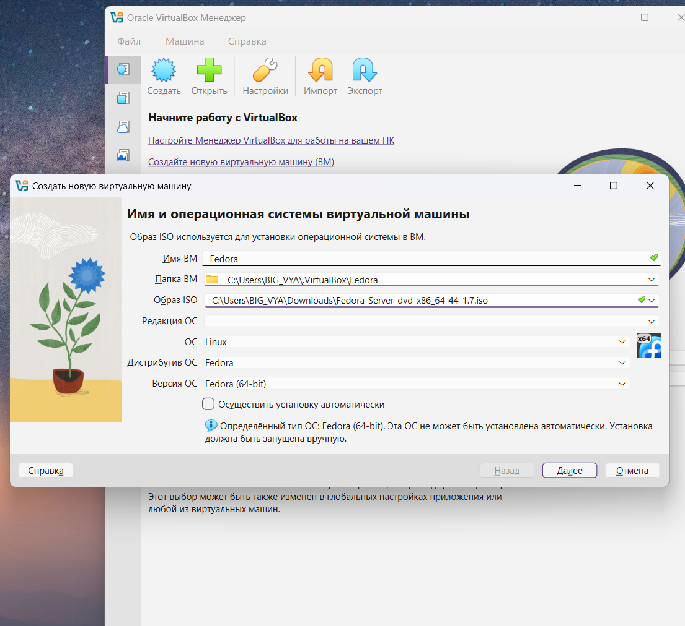

Из этапов создания, думаю, что остановлюсь и расскажу о выделении ресурсов для ВМ и о монтировании диска.

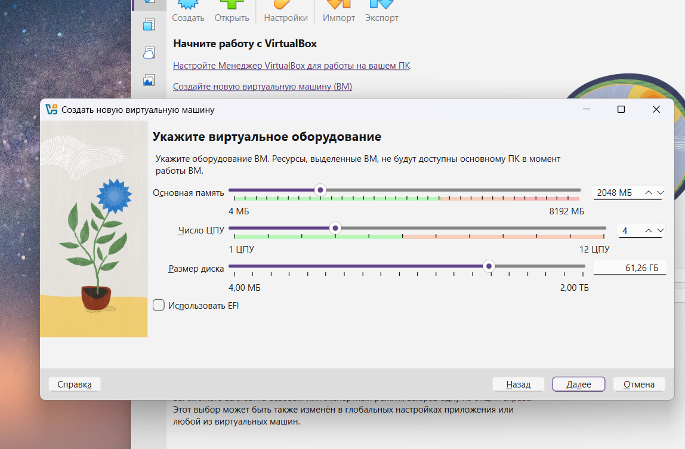

Для этого теста 2 ГБ оперативной памяти более чем достаточно, а на жестком диске решил с запасом взять памяти - 60 ГБ, планирую использовать эту ВМ для самообразования. В остальном выполнял установку по инструкции.

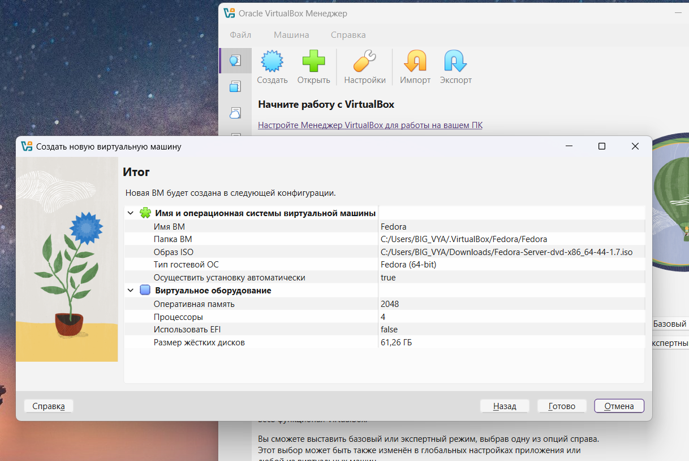

Предпочитаю в ручную монтировать диск. Я разбил его на три основных раздела:
1. **BIOS Boot (sda1)** - выделил 1 МБ. Этот технический раздел.
2. **/boot (sda2)** - отдал под него 2 ГБ и накатил файловую систему **ext4**.
3. **Корень `/` (sda3)** - забрал все оставшиеся 44 ГБ.  

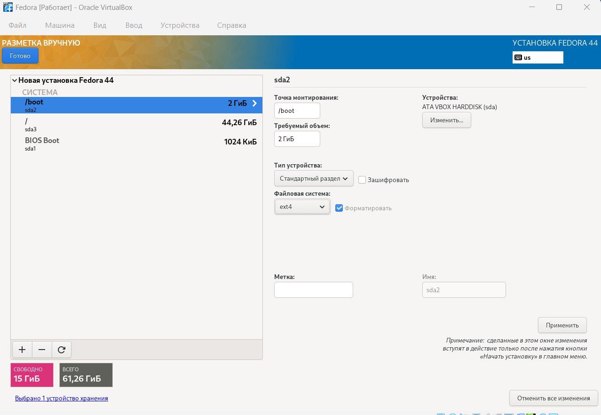

После этапов "настройки" установил ВМ.

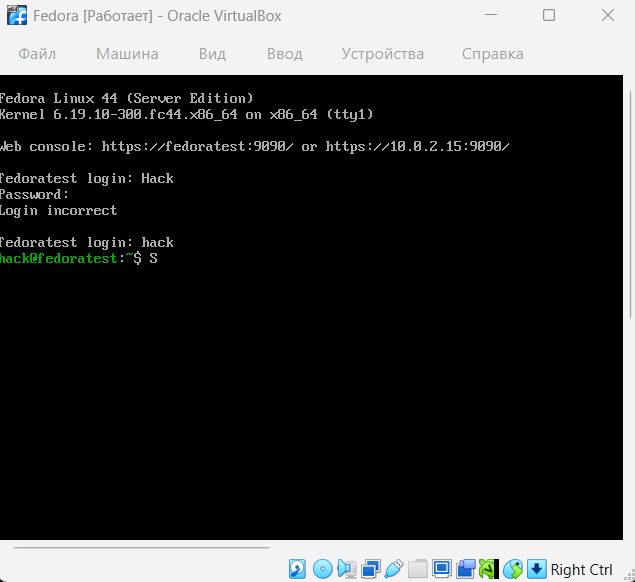

Затем я приступил к подключению по SSH, сделал это через Power Shell.
Сначала я узнал ip ВМ

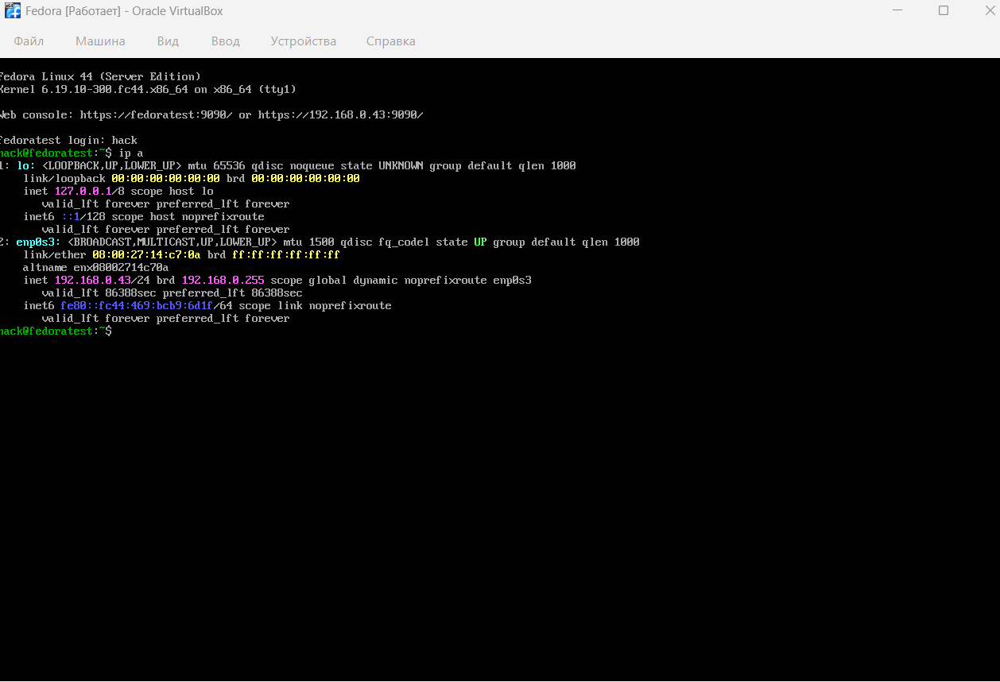

Затем подключился как пользователь, потом подключился с root правами 

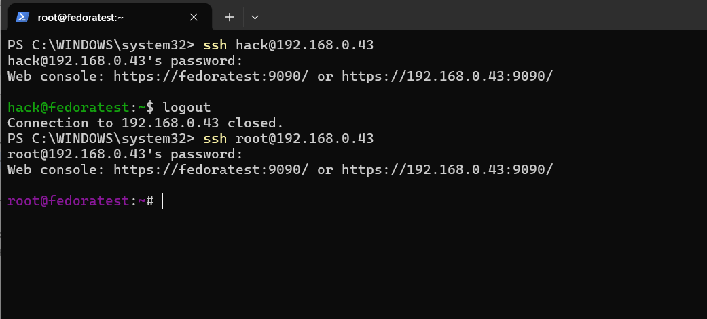

---

### Часть 1: Установка программ и настройка окружения

Вторую часть начал с установки git 

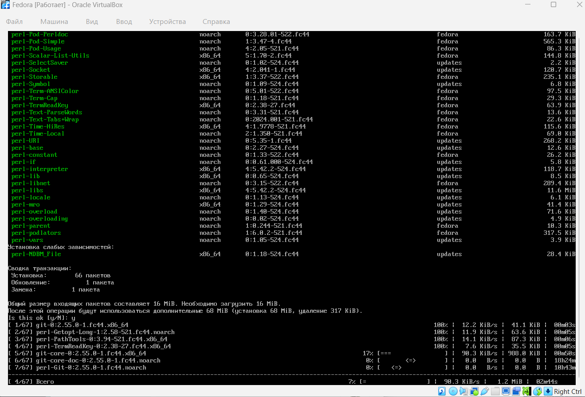

После установки проверил "на месте ли git"

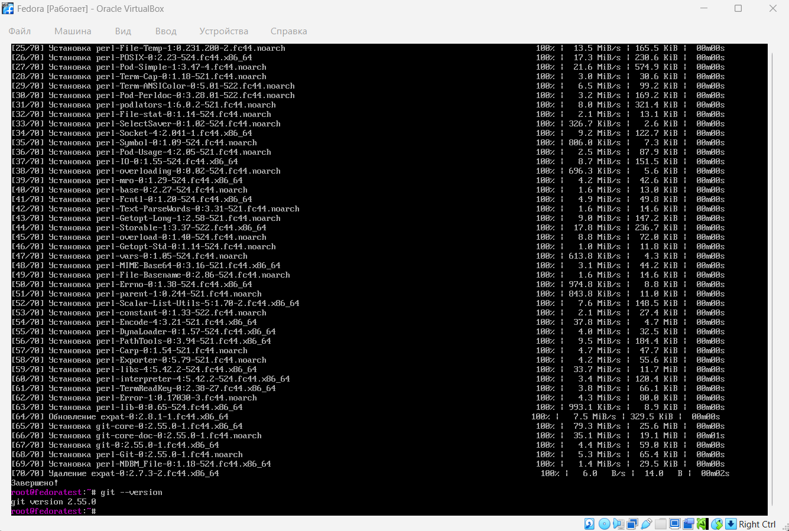

Затем приступил к настройке SSH-ключу для работы с GitHub, т.к. аккаунт на GitHub у меня уже был.

Создал SSH-ключ.

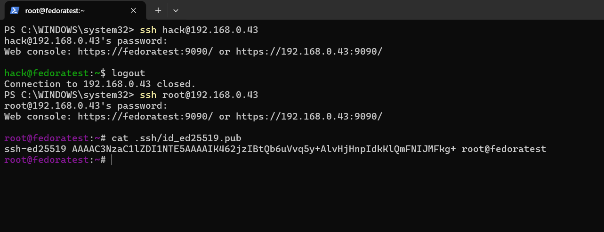 

Затем добавил его на свой аккаунт GitHub.

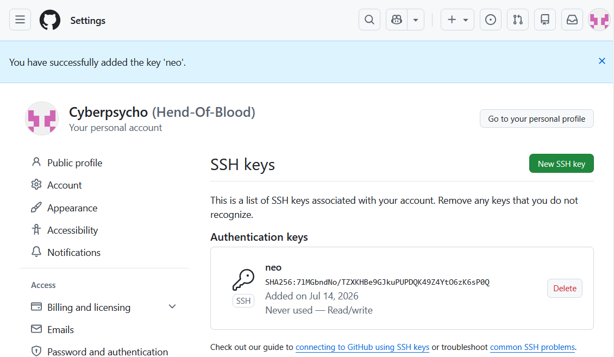 

---

### Часть 2: Работа с GitHub

Я создал публичный репозиторий на GitHub с названием my-first-devops.
И внутри него файл README.md. После склонировал репозиторий на компьютер и перешёл в директорию.

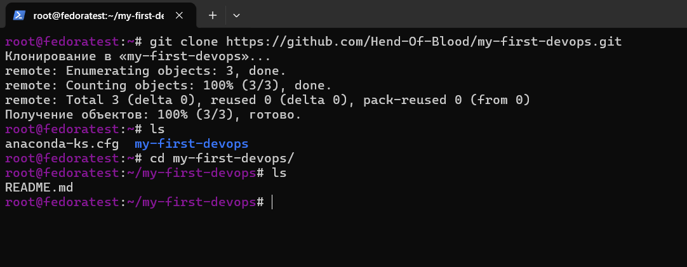 

---

### Часть 3: Установка и работа с Docker

Следуя инструкции, я установил Docker и убедился, что он работает. 

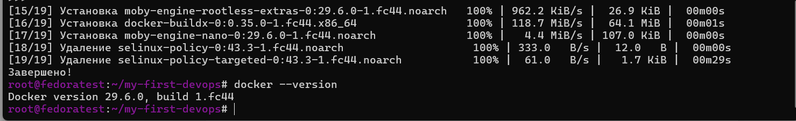 

Далее я запустил Docker-контейнер с образом hello-world и убедился, что контейнер успешно запустился и вывел сообщение.

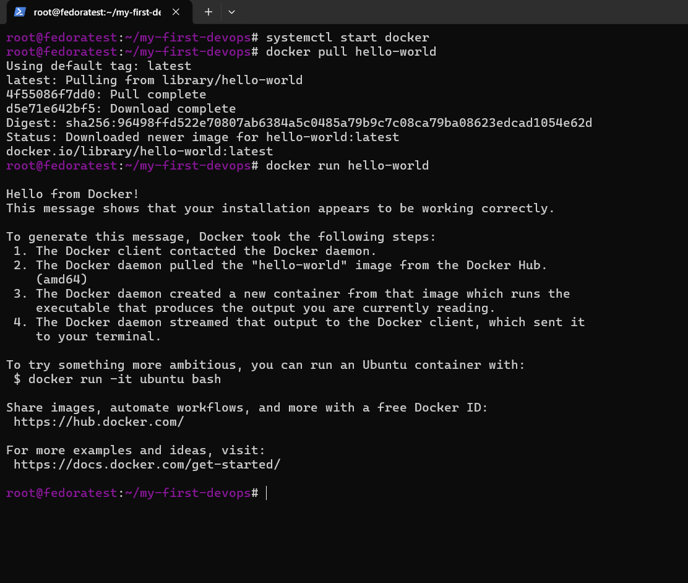

---

### Часть 4: Расширение работы с Docker

В папке репозитория я создал файл с именем Dockerfile и написал код, который будет запускать простой скрипт на Python.

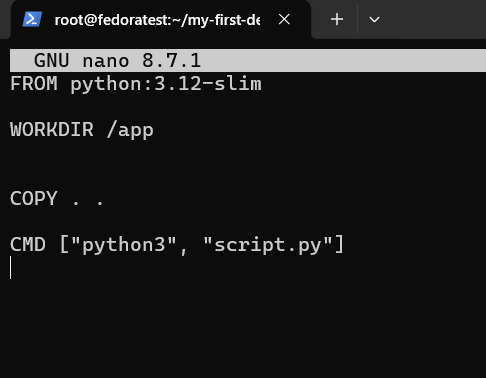 

Рядом с Dockerfile создал файл script.py и написал простой код, который выводит: "Hello, DevOps world!"

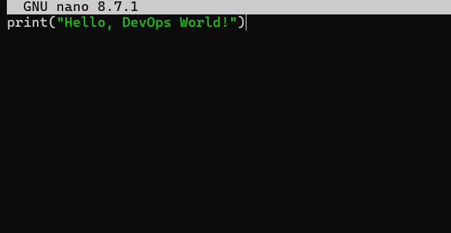

Затем я собрал Docker-образ и запустил контейнер, который выводит сообщение Hello, DevOps World!.

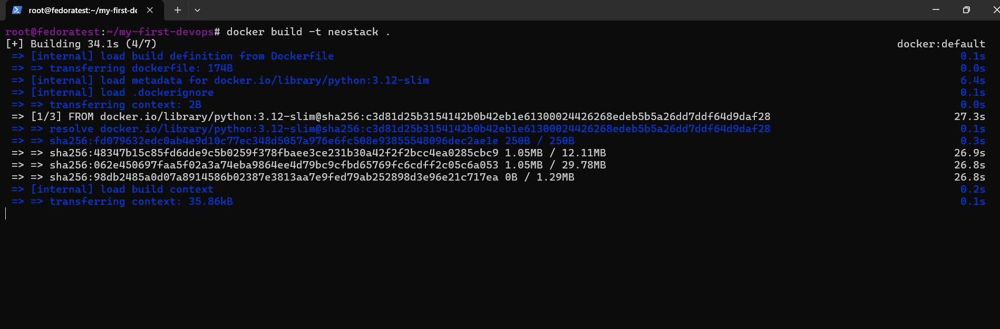

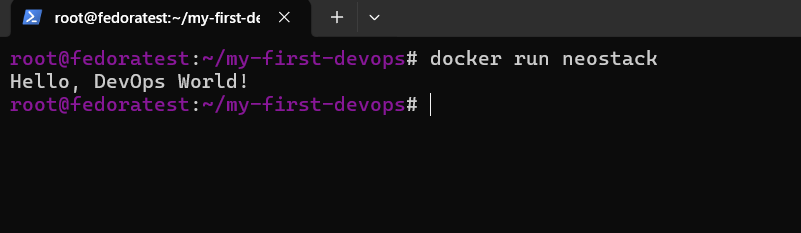

---

### Проблемы, с которыми я столкнулся, и их решение

В целом, никаких проблем при выполнении теста не возникло. Все этапы легкие.
